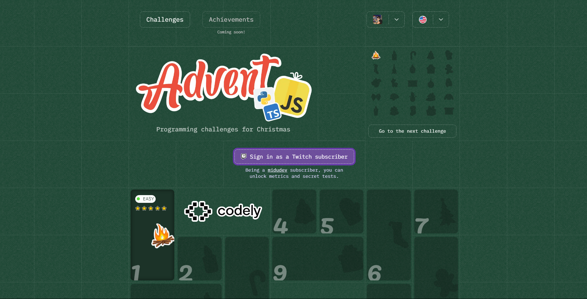

# AdventJS - 2024 🎅🏻



**💋 Calendario de Adviento de retos de programación en JavaScript •**
**[adventjs.dev](https://adventjs.dev/)**

**Este repositorio contiene mis intentos de solución a los retos de programación de [AdventJS 2024](https://adventjs.dev/).**

## 🎄 Retos

| Día |                                     Reto                                     | Dificultad |                                         Solución                                         | Estrellas  |
| :-: | :--------------------------------------------------------------------------: | :--------: | :--------------------------------------------------------------------------------------: | ---------- |
| 01  | [**🎁 ¡Primer regalo repetido!**](https://adventjs.dev/es/challenges/2024/1) |     🟢     | [**codigo**](https://github.com/jeancdevx/adventjs-2024/blob/master/ejercicio1/index.js) | ⭐⭐⭐⭐⭐ |

## 📝 Clonar

```bash
git clone git@github.com:jeancdevx/adventjs-2024.git
cd adventjs-2024
```

## 🧑🏻‍💻 Autor

[**@jeanc.dev**](https://github.com/jeancdevx)
